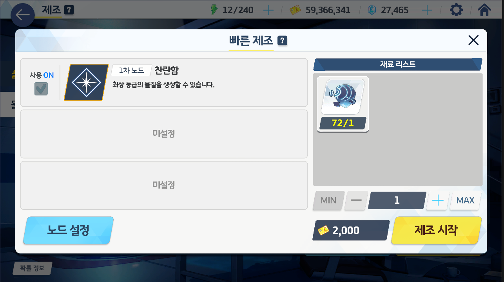
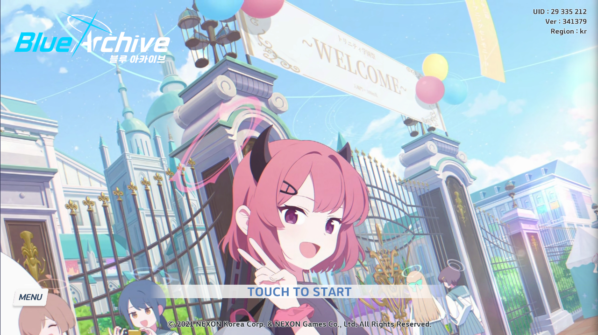

# Introduction

Daily missions in Blue Archive are painfully repetitive, and take a lot of time to complete.
They reduce the fun aspect of the game, making it more of a chore then enjoyment, hence the name: homework.

This project aims to reduce the chore-like nature of daily missions by automating many of them.

## This Project Automates

- 전술대회 - 전투스킵 (Tactical Challenge - Skip)
- 카페 - AP 수급 (Cafe - AP Collect)
- 스케줄 (Lesson)
- 소셜 - 서클 AP 수집 (Social - Circle AP Collect)
- 제조 - 빠른제조 (Crafting - Fast Craft)
- 상점 - AP 구매 (Shop - Buy AP)
- 미션 - 보상받기 (Tasks - Receive All)

## This Project Does Not Automate

- AP 사용 (AP usage)
- 카페 학생 교류 (Cafe Student Interaction)
- 총력전 (Total Assault)
- 종합전술시험 (Joint Firing Drill)
- 제약해제결전 (Final Restriction Release)
- 대결전 (Grand Assault)
- 이벤트 (Events)

## Prerequisites

- Bluestacks
- Both Monthly Pyroxene package
- Game Language: Korean
- Progressed enough, around Lv.80 or more
- Must have at least one `Quick Create` setup

## Execution

- Start program at the screen where the text `TOUCH TO START` is located.

---

# ⚠️ Disclaimer

This project interacts with the game via automated means and may violate the game's Terms of Service. Use at your own risk.
